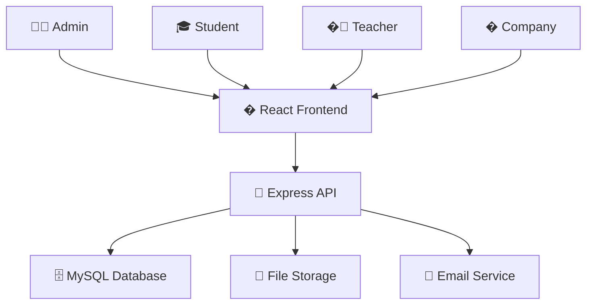

<h2 align="center">
    <a href="https://dainam.edu.vn/vi/khoa-cong-nghe-thong-tin">
    🎓 Faculty of Information Technology (DaiNam University)
    </a>
</h2>
<h2 align="center">
   Hệ thống Quản lý Thực tập Sinh viên
</h2>
<div align="center">
    <p align="center">
        
        
        
    </p>

[](https://reactjs.org/)
[](https://www.typescriptlang.org/)
[](https://nodejs.org/)
[](https://www.mysql.com/)

[](https://www.facebook.com/DNUAIoTLab)
[](https://dainam.edu.vn/vi/khoa-cong-nghe-thong-tin)
[](https://dainam.edu.vn)

</div>

## ✨ Giới thiệu

> **Hệ thống Quản lý Thực tập Sinh viên** - Giải pháp số hóa toàn diện cho quy trình thực tập

Hệ thống được phát triển để **tối ưu hóa** và **tự động hóa** toàn bộ quy trình thực tập sinh viên, từ đăng ký ban đầu đến đánh giá cuối kỳ. Kết nối liền mạch giữa **4 đối tượng chính**: Admin, Sinh viên, Giảng viên và Doanh nghiệp qua giao diện web hiện đại.

### 🚀 Tầm nhìn

<table>
<tr>
<td width="50%">

**🎯 Số hóa hoàn toàn**  
Chuyển đổi quy trình thủ công sang digital workflow

**⚡ Phân công thông minh**  
Auto-assignment dựa trên AI và preferences

</td>
<td width="50%">

**📊 Báo cáo real-time**  
Dashboard và analytics cho mọi stakeholder

**🔄 Quy trình minh bạch**  
Tracking và audit trail đầy đủ

</td>
</tr>
</table>

### �️ **Backend Architecture**

<details>
<summary><b>🖥️ Node.js + Express Server</b></summary>

```
📡 RESTful API với Swagger documentation
� JWT Authentication & Role-based Authorization  
🤖 Auto-assignment Algorithm với AI matching
📁 File Management với validation & security
📊 Excel Import/Export với intelligent mapping
🔒 bcrypt + Rate Limiting + Security headers
📧 Notification System với email integration
💾 Database Migration & Backup automation
```

</details>

### 🎨 **Frontend Experience**

<details>
<summary><b>⚛️ React + TypeScript SPA</b></summary>

```
� JWT Authentication với Forgot Password flow
📊 Role-based Dashboards với real-time analytics
👥 Full CRUD Operations với optimistic updates
📅 Smart Assignment System với drag-and-drop
📝 Rich Report Management với file previews
🎯 One-click Auto-assignment với progress tracking
📂 Drag-and-drop Excel Import với live validation
🔍 Advanced Search/Filter với debounced queries
🎨 Modern UI với TailwindCSS + Lucide icons
📱 Mobile-first Responsive Design
⚡ Loading States + Error Boundaries + Toast notifications
```

</details>

### 🏗️ **System Architecture**



<table>
<tr>
<td><b>🎨 Frontend Stack</b></td>
<td><b>🖥️ Backend Stack</b></td>
<td><b>�️ Database & Tools</b></td>
</tr>
<tr>
<td>

`React 19+`  
`TypeScript`  
`Vite`  
`TailwindCSS`  
`React Router`

</td>
<td>

`Node.js 18+`  
`Express.js`  
`JWT Auth`  
`bcrypt`  
`Multer`

</td>
<td>

`MySQL 8.0+`  
`ExcelJS`  
`Swagger UI`  
`Rate Limiting`  
`CORS`

</td>
</tr>
</table>

## 🔥 Tech Stack

<div align="center">

### Frontend Powerhouse
[](https://reactjs.org/)
[](https://www.typescriptlang.org/)
[](https://vitejs.dev/)
[](https://tailwindcss.com/)

### Backend Excellence  
[](https://nodejs.org/)
[](https://expressjs.com/)
[](https://www.mysql.com/)
[](https://jwt.io/)

</div>

### 🚀 **Frontend**
- ⚛️ React 19+ với TypeScript
- ⚡ Vite (build tool)
- � TailwindCSS (styling)
- 🔗 React Router (navigation)
- 📊 Lucide React (icons)
- 📄 ExcelJS (Excel processing)

### 🖥️ **Backend**
- � Node.js + Express.js
- 🗄️ MySQL 8.0+ với connection pooling
- 🔐 JWT (JsonWebToken) authentication
- 🔒 bcrypt (password hashing)
- 📁 Multer (file upload)
- 📊 ExcelJS (import/export)
- 📝 Swagger (API documentation)

### 🛠️ **DevOps & Tools**
- 📦 NPM package management
- 🔧 ESLint + TypeScript config
- 🗂️ Migration scripts
- 📋 CORS và rate limiting

## ✨ Key Features

### 🎭 User Roles & Permissions

<table>
<tr>
<th width="25%">�‍💼 Admin</th>
<th width="25%">🎓 Student</th>
<th width="25%">👨‍🏫 Teacher</th>
<th width="25%">🏢 Company</th>
</tr>
<tr>
<td>

**System Management**  
Create internship batches  
Import bulk data  
User administration  
Analytics & reports

</td>
<td>

**Registration & Reports**  
Apply for internships  
Submit weekly reports  
View grades & feedback  
Track progress

</td>
<td>

**Student Supervision**  
Manage assigned students  
Grade & evaluate  
Review reports  
Provide guidance

</td>
<td>

**Intern Management**  
View assigned interns  
Evaluate performance  
Provide feedback  
Post job openings

</td>
</tr>
</table>

### 🚀 Smart Features

<div align="center">

| 🤖 **Auto-Assignment** | 📊 **Real-time Dashboard** | 📝 **Report Management** |
|:---:|:---:|:---:|
| AI-powered matching | Live analytics | Batch submissions |
| Load balancing | Role-based views | Automated grading |
| Position preferences | Progress tracking | File management |

</div>

### 🎯 **Workflow Excellence**

```
📋 Registration → 🎲 Auto-Assignment → 📅 Internship Period → 📝 Weekly Reports → 📊 Evaluation → 🎓 Completion
```

## 🚀 Quick Start

### 📋 Prerequisites

<div align="center">

| Tool | Version | Purpose |
|:---:|:---:|:---:|
| � Node.js | `18+` | Runtime environment |
| �️ MySQL | `8.0+` | Database server |
| 📦 NPM/Yarn | `Latest` | Package manager |
| � OS | `Win/Linux/macOS` | Development platform |

</div>

### ⚡ Installation

<details>
<summary><b>🔽 Step-by-step Setup Guide</b></summary>

#### **1️⃣ Clone & Navigate**
```bash
git clone https://github.com/lamngoctuu18/chuyen_doi_so1.git
cd chuyen_doi_so1
```

#### **2️⃣ Backend Setup**
```bash
cd backend
npm install
cp .env.example .env    # Configure your database
npm run setup          # Initialize DB & seed data
npm start              # 🚀 Server running on :3001
```

#### **3️⃣ Frontend Setup**
```bash
cd ../quanly-thuctap
npm install
npm run dev            # 🌐 App running on :5173
```

#### **4️⃣ Access Applications**
- **Frontend**: http://localhost:5173
- **API**: http://localhost:3001  
- **Swagger**: http://localhost:3001/api-docs

</details>

### � Demo Accounts

<table align="center">
<tr>
<th>🎯 Role</th>
<th>📧 Email</th>
<th>🔑 Password</th>
<th>📝 Access Level</th>
</tr>
<tr>
<td><b>👨‍💼 Admin</b></td>
<td><code>admin@dainam.edu.vn</code></td>
<td><code>admin123</code></td>
<td>Full system control</td>
</tr>
<tr>
<td><b>🎓 Student</b></td>
<td><code>sv001@dainam.edu.vn</code></td>
<td><code>sv123</code></td>
<td>Registration & reports</td>
</tr>
<tr>
<td><b>👨‍🏫 Teacher</b></td>
<td><code>gv001@dainam.edu.vn</code></td>
<td><code>gv123</code></td>
<td>Student supervision</td>
</tr>
<tr>
<td><b>🏢 Company</b></td>
<td><code>dn001@company.com</code></td>
<td><code>dn123</code></td>
<td>Intern evaluation</td>
</tr>
</table>

## � Project Structure

<details>
<summary><b>🗂️ Explore Codebase Architecture</b></summary>

```
📦 chuyen_doi_so1/
├── 🖥️ backend/                 # Node.js API Server
│   ├── 📁 src/
│   │   ├── 🎛️ controllers/     # Business Logic & API Handlers
│   │   ├── 📊 models/         # Database Models & Queries
│   │   ├── 🛤️ routes/         # Express Route Definitions
│   │   ├── ⚙️ config/         # Database & Application Config
│   │   └── 🔧 utils/          # Helper Functions & Utilities
│   ├── 📁 uploads/            # User File Storage
│   ├── 📄 package.json        # Dependencies & Scripts
│   └── 📚 docs/              # API Documentation
├── 🎨 quanly-thuctap/         # React Frontend SPA
│   ├── 📁 src/
│   │   ├── 🧩 components/     # Reusable UI Components
│   │   ├── 📄 pages/          # Route-based Page Components  
│   │   ├── 🪝 hooks/          # Custom React Hooks
│   │   ├── 🔧 utils/          # Frontend Helper Functions
│   │   └── 🎯 types/          # TypeScript Type Definitions
│   └── 📄 package.json        # Frontend Dependencies
├── 📚 docs/                   # Project Documentation
├── 🛠️ scripts/                # Setup & Deployment Scripts
└── 📖 README.md               # You are here! 👋
```

</details>

## 📚 Documentation Hub

<div align="center">

| 📖 Guide | 🎯 Purpose | 🔗 Link |
|:---:|:---:|:---:|
| **API Docs** | Backend endpoints & schemas | [📡 Swagger](backend/SWAGGER_API_DOCS.md) |
| **Frontend Guide** | Component library & patterns | [🎨 Components](quanly-thuctap/README.md) |
| **Database Schema** | Tables & relationships | [🗄️ Schema](backend/CLEANUP_SUMMARY.md) |
| **Deployment** | Production setup guide | [🚀 Deploy](docs/INTEGRATION_GUIDE.md) |

</div>

## 🌐 Application URLs

<div align="center">

[](http://localhost:5173)
[](http://localhost:3001)
[](http://localhost:3001/api-docs)

</div>

## 🤝 Contributing

<details>
<summary><b>🚀 How to Contribute</b></summary>

```bash
# 1️⃣ Fork the repo
git clone https://github.com/your-username/chuyen_doi_so1.git

# 2️⃣ Create feature branch  
git checkout -b feature/amazing-feature

# 3️⃣ Make your changes
git add .
git commit -m "✨ Add amazing feature"

# 4️⃣ Push to your fork
git push origin feature/amazing-feature

# 5️⃣ Open Pull Request
# Visit GitHub and create PR with detailed description
```

**🎯 Contribution Guidelines**  
- Follow existing code style and patterns
- Add tests for new features  
- Update documentation as needed
- Keep commits atomic and descriptive

</details>

---

<div align="center">

## �‍💻 Developer


**Lâm Ngọc Tú**  
🎓 CNTT 16-01  
🏛️ Đại học Đại Nam - Khoa CNTT  

[](mailto:lamngoctuk55@gmail.com)
[](https://github.com/lamngoctuu18)

---

<sub>💝 Made with passion for education technology</sub>

</div>
