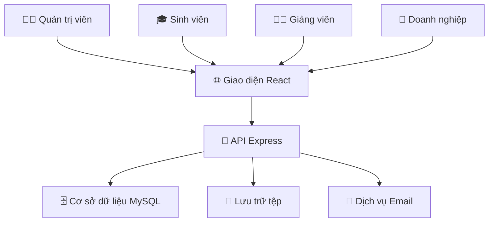

<h2 align="center">
    <a href="https://dainam.edu.vn/vi/khoa-cong-nghe-thong-tin">
    🎓 Faculty of Information Technology (DaiNam University)
    </a>
</h2>
<h2 align="center">
   Hệ thống Quản lý Thực tập Sinh viên
</h2>
<div align="center">
    <p align="center">
        
        
        
    </p>

[](https://reactjs.org/)
[](https://www.typescriptlang.org/)
[](https://nodejs.org/)
[](https://www.mysql.com/)

[](https://www.facebook.com/DNUAIoTLab)
[](https://dainam.edu.vn/vi/khoa-cong-nghe-thong-tin)
[](https://dainam.edu.vn)

</div>

## ✨ Giới thiệu hệ thống

> **Hệ thống Quản lý Thực tập Sinh viên** - Giải pháp số hóa toàn diện cho quy trình thực tập

Hệ thống được phát triển để **tối ưu hóa** và **tự động hóa** toàn bộ quy trình thực tập sinh viên, từ đăng ký ban đầu đến đánh giá cuối kỳ. Kết nối liền mạch giữa **4 đối tượng chính**: Quản trị viên, Sinh viên, Giảng viên và Doanh nghiệp qua giao diện web hiện đại.

### 🚀 Mục tiêu phát triển

<div align="center">

| 🎯 **Số hóa hoàn toàn** | ⚡ **Phân công thông minh** |
|:---:|:---:|
| Chuyển đổi quy trình thủ công sang quy trình điện tử | Phân công tự động dựa trên thuật toán và sở thích |

| 📊 **Báo cáo thời gian thực** | 🔄 **Quy trình minh bạch** |
|:---:|:---:|
| Bảng điều khiển và thống kê cho tất cả người dùng | Theo dõi và lưu vết đầy đủ mọi hoạt động |

</div>

### 🛠️ **Kiến trúc máy chủ**

<details>
<summary><b>🖥️ Máy chủ Node.js + Express</b></summary>

```
📡 RESTful API với tài liệu Swagger
🔐 Xác thực JWT và phân quyền theo vai trò  
🤖 Thuật toán phân công tự động với khớp nối thông minh
📁 Quản lý tệp với xác thực và bảo mật
📊 Nhập/Xuất Excel với ánh xạ thông minh
🔒 Mã hóa bcrypt + Giới hạn tốc độ + Tiêu đề bảo mật
📧 Hệ thống thông báo với tích hợp email
💾 Di chuyển cơ sở dữ liệu và sao lưu tự động
```

</details>

### 🎨 **Trải nghiệm giao diện**

<details>
<summary><b>⚛️ Ứng dụng React + TypeScript</b></summary>

```
🔐 Xác thực JWT với luồng quên mật khẩu
📊 Bảng điều khiển theo vai trò với phân tích thời gian thực
👥 Thao tác CRUD đầy đủ với cập nhật tối ưu
📅 Hệ thống phân công thông minh với kéo thả
📝 Quản lý báo cáo phong phú với xem trước tệp
🎯 Phân công tự động một cú nhấp với theo dõi tiến trình
📂 Nhập Excel kéo thả với xác thực trực tiếp
🔍 Tìm kiếm/Lọc nâng cao với truy vấn tối ưu
🎨 Giao diện hiện đại với TailwindCSS + biểu tượng Lucide
📱 Thiết kế đáp ứng ưu tiên di động
⚡ Trạng thái tải + Xử lý lỗi + Thông báo nổi
```

</details>

### 🏗️ **Kiến trúc hệ thống**



<table>
<tr>
<td><b>🎨 Frontend Stack</b></td>
<td><b>🖥️ Backend Stack</b></td>
<td><b>�️ Database & Tools</b></td>
</tr>
<tr>
<td>

`React 19+`  
`TypeScript`  
`Vite`  
`TailwindCSS`  
`React Router`

</td>
<td>

`Node.js 18+`  
`Express.js`  
`JWT Auth`  
`bcrypt`  
`Multer`

</td>
<td>

`MySQL 8.0+`  
`ExcelJS`  
`Swagger UI`  
`Rate Limiting`  
`CORS`

</td>
</tr>
</table>

## � Công nghệ sử dụng

<div align="center">

### 🎨 Công nghệ giao diện người dùng
[](https://reactjs.org/)
[](https://www.typescriptlang.org/)
[](https://vitejs.dev/)
[](https://tailwindcss.com/)

### 🖥️ Công nghệ máy chủ  
[](https://nodejs.org/)
[](https://expressjs.com/)
[](https://www.mysql.com/)
[](https://jwt.io/)

</div>

### 🚀 **Frontend**
- ⚛️ React 19+ với TypeScript
- ⚡ Vite (build tool)
- � TailwindCSS (styling)
- 🔗 React Router (navigation)
- 📊 Lucide React (icons)
- 📄 ExcelJS (Excel processing)

### 🖥️ **Backend**
- � Node.js + Express.js
- 🗄️ MySQL 8.0+ với connection pooling
- 🔐 JWT (JsonWebToken) authentication
- 🔒 bcrypt (password hashing)
- 📁 Multer (file upload)
- 📊 ExcelJS (import/export)
- 📝 Swagger (API documentation)

### 🛠️ **DevOps & Tools**
- 📦 NPM package management
- 🔧 ESLint + TypeScript config
- 🗂️ Migration scripts
- 📋 CORS và rate limiting

## ✨ Tính năng nổi bật

### 🎭 Vai trò người dùng & Quyền hạn

<table>
<tr>
<th width="25%">👨‍💼 Quản trị viên</th>
<th width="25%">🎓 Sinh viên</th>
<th width="25%">👨‍🏫 Giáo viên</th>
<th width="25%">🏢 Doanh nghiệp</th>
</tr>
<tr>
<td>

**Quản lý hệ thống**  
Tạo đợt thực tập  
Nhập dữ liệu hàng loạt  
Quản trị người dùng  
Phân tích & báo cáo

</td>
<td>

**Đăng ký & Báo cáo**  
Đăng ký thực tập  
Nộp báo cáo hàng tuần  
Xem điểm & phản hồi  
Theo dõi tiến độ

</td>
<td>

**Giám sát sinh viên**  
Quản lý sinh viên được phân công  
Chấm điểm & đánh giá  
Xem xét báo cáo  
Cung cấp hướng dẫn

</td>
<td>

**Quản lý thực tập sinh**  
Xem thực tập sinh được phân công  
Đánh giá hiệu suất  
Cung cấp phản hồi  
Đăng tin tuyển dụng

</td>
</tr>
</table>

### 🚀 Tính năng thông minh

<div align="center">

| 🤖 **Phân công tự động** | 📊 **Bảng điều khiển thời gian thực** | 📝 **Quản lý báo cáo** |
|:---:|:---:|:---:|
| Khớp nối dựa trên thuật toán | Phân tích trực tiếp | Nộp theo lô |
| Cân bằng tải | Giao diện theo vai trò | Chấm điểm tự động |
| Sở thích vị trí | Theo dõi tiến độ | Quản lý tệp tin |

</div>

### 🎯 **Quy trình làm việc xuất sắc**

```
📋 Đăng ký → 🎲 Phân công tự động → 📅 Thời gian thực tập → 📝 Báo cáo hàng tuần → 📊 Đánh giá → 🎓 Hoàn thành
```

## 🚀 Hướng dẫn bắt đầu

### 📋 Yêu cầu hệ thống

<div align="center">

| Công cụ | Phiên bản | Mục đích |
|:---:|:---:|:---:|
| 🟢 Node.js | `18+` | Môi trường chạy |
| 🗄️ MySQL | `8.0+` | Máy chủ cơ sở dữ liệu |
| 📦 NPM/Yarn | `Mới nhất` | Quản lý gói |
| 💻 Hệ điều hành | `Win/Linux/macOS` | Nền tảng phát triển |

</div>

### ⚡ Cài đặt

<details>
<summary><b>🔽 Hướng dẫn cài đặt từng bước</b></summary>

#### **1️⃣ Sao chép và điều hướng**
```bash
git clone https://github.com/lamngoctuu18/chuyen_doi_so1.git
cd chuyen_doi_so1
```

#### **2️⃣ Cài đặt máy chủ**
```bash
cd backend
npm install
cp .env.example .env    # Cấu hình cơ sở dữ liệu
npm run setup          # Khởi tạo DB và dữ liệu mẫu
npm start              # 🚀 Máy chủ chạy trên cổng :3001
```

#### **3️⃣ Cài đặt giao diện**
```bash
cd ../quanly-thuctap
npm install
npm run dev            # 🌐 Ứng dụng chạy trên cổng :5173
```

#### **4️⃣ Truy cập ứng dụng**
- **Giao diện người dùng**: http://localhost:5173
- **API**: http://localhost:3001  
- **Tài liệu Swagger**: http://localhost:3001/api-docs

</details>

### � Demo Accounts

<table align="center">
<tr>
<th>🎯 Role</th>
<th>📧 Email</th>
<th>🔑 Password</th>
<th>📝 Access Level</th>
</tr>
<tr>
<td><b>👨‍💼 Admin</b></td>
<td><code>admin@dainam.edu.vn</code></td>
<td><code>admin123</code></td>
<td>Full system control</td>
</tr>
<tr>
<td><b>🎓 Student</b></td>
<td><code>sv001@dainam.edu.vn</code></td>
<td><code>sv123</code></td>
<td>Registration & reports</td>
</tr>
<tr>
<td><b>👨‍🏫 Teacher</b></td>
<td><code>gv001@dainam.edu.vn</code></td>
<td><code>gv123</code></td>
<td>Student supervision</td>
</tr>
<tr>
<td><b>🏢 Company</b></td>
<td><code>dn001@company.com</code></td>
<td><code>dn123</code></td>
<td>Intern evaluation</td>
</tr>
</table>

## 📂 Cấu trúc dự án

<details>
<summary><b>🗂️ Khám phá kiến trúc mã nguồn</b></summary>

```
📦 chuyen_doi_so1/
├── 🖥️ backend/                 # Máy chủ API Node.js
│   ├── 📁 src/
│   │   ├── 🎛️ controllers/     # Logic nghiệp vụ & Xử lý API
│   │   ├── 📊 models/         # Mô hình cơ sở dữ liệu & Truy vấn
│   │   ├── 🛤️ routes/         # Định nghĩa tuyến đường Express
│   │   ├── ⚙️ config/         # Cấu hình cơ sở dữ liệu & Ứng dụng
│   │   └── 🔧 utils/          # Hàm hỗ trợ & Tiện ích
│   ├── 📁 uploads/            # Lưu trữ tệp người dùng
│   ├── 📄 package.json        # Phụ thuộc & Tập lệnh
│   └── 📚 docs/              # Tài liệu API
├── 🎨 quanly-thuctap/         # Giao diện React SPA
│   ├── 📁 src/
│   │   ├── 🧩 components/     # Thành phần UI có thể tái sử dụng
│   │   ├── 📄 pages/          # Thành phần trang theo tuyến đường  
│   │   ├── 🪝 hooks/          # Hook React tùy chỉnh
│   │   ├── 🔧 utils/          # Hàm hỗ trợ giao diện
│   │   └── 🎯 types/          # Định nghĩa kiểu TypeScript
│   └── 📄 package.json        # Phụ thuộc giao diện
├── 📚 docs/                   # Tài liệu dự án
├── 🛠️ scripts/                # Tập lệnh cài đặt & Triển khai
└── 📖 README.md               # Bạn đang ở đây! 👋
```

</details>

## 📚 Trung tâm tài liệu

<div align="center">

| 📖 Hướng dẫn | 🎯 Mục đích | 🔗 Liên kết |
|:---:|:---:|:---:|
| **Tài liệu API** | Điểm cuối máy chủ và lược đồ | [📡 Swagger](backend/SWAGGER_API_DOCS.md) |
| **Hướng dẫn giao diện** | Thư viện thành phần và mẫu | [🎨 Components](quanly-thuctap/README.md) |
| **Lược đồ cơ sở dữ liệu** | Bảng và mối quan hệ | [🗄️ Schema](backend/CLEANUP_SUMMARY.md) |
| **Triển khai** | Hướng dẫn cài đặt sản xuất | [🚀 Deploy](docs/INTEGRATION_GUIDE.md) |

</div>

## 🌐 Địa chỉ ứng dụng

<div align="center">

[](http://localhost:5173)
[](http://localhost:3001)
[](http://localhost:3001/api-docs)

</div>

## 🤝 Đóng góp

<details>
<summary><b>🚀 Cách đóng góp</b></summary>

```bash
# 1️⃣ Fork repository
git clone https://github.com/your-username/chuyen_doi_so1.git

# 2️⃣ Tạo nhánh tính năng  
git checkout -b feature/tinh-nang-tuyet-voi

# 3️⃣ Thực hiện thay đổi
git add .
git commit -m "✨ Thêm tính năng tuyệt vời"

# 4️⃣ Đẩy lên fork của bạn
git push origin feature/tinh-nang-tuyet-voi

# 5️⃣ Tạo Pull Request
# Truy cập GitHub và tạo PR với mô tả chi tiết
```

**🎯 Hướng dẫn đóng góp**  
- Tuân thủ phong cách mã và mẫu hiện có
- Thêm kiểm thử cho tính năng mới  
- Cập nhật tài liệu khi cần thiết
- Giữ commit nguyên tử và mô tả rõ ràng

</details>

---

<div align="center">

## 👨‍💻 Nhà phát triển


**Lâm Ngọc Tú**  
🎓 CNTT 16-01  
🏛️ Đại học Đại Nam - Khoa CNTT  

[](mailto:lamngoctuk55@gmail.com)
[](https://github.com/lamngoctuu18)

---

<sub>💝 Được tạo ra với đam mê cho công nghệ giáo dục</sub>

</div>
